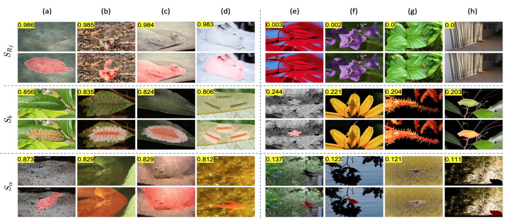

# The Making and Breaking of Camouflage
This repository provides the code for our paper: The Making and Breaking of Camouflage [ICCV'23]. Hala Lamdouar, Weidi Xie and Andrew Zisserman.
[paper PDF](https://www.robots.ox.ac.uk/~vgg/publications/2023/Lamdouar23/lamdouar23.pdf)


### Dataset Preparation Steps
<ol>
<li>Crop the images around the camouflaged animal so that only its immediate surrounding area is taken into account: 

For a still image dataset:
```
python utils/crop.py --data_dir ../datasets/CHAMELEON --out_data_dir ../datasets/CHAMELEON_crop --type still
```

For a video dataset:
```
python utils/crop.py --data_dir ../datasets/MoCA_Video/TrainDataset_per_sq/ --out_data_dir ../datasets/Moca_Video_Train_crop --type video
```
</li> 

<li> To compute the boundary score and the combined score, generate global contours (for the cropped images) and ground truth contours (for the object of interest, using the mask) with an off-the-shelf contour detection method, e.g. [DexiNed](https://github.com/xavysp/DexiNed).</li> 

<li> Compute camouflage scores</li>

```
python eval.py --data_dir ../CHAMELEON_crop/ --type still --contour_path ../DexiNed/result/BIPED2CHAM/fused/ --contour_gt_path ../DexiNed/result/BIPED2CHAM-GT/fused/
```

</ol>

Probabilistic scoring functions and more implementation will be added soon.

### Acknowledgement
This research is supported by the UK EPSRC funded CDT in Autonomous Intelligent Machines and Systems (AIMS), the EPSRC Pro- gramme Grant VisualAI EP/T028572/1, a Schlumberger Studentship, and a Royal Society Research Professorship. WX is supported by the National Key R&D Program of China (No. 2022ZD0161400).

### Citation

Please consider citing our paper: 

```
@InProceedings{Lamdouar23,
  author       = "Hala Lamdouar and Weidi Xie and Andrew Zisserman",
  title        = "The Making and Breaking of Camouflage",
  booktitle    = "IEEE International Conference on Computer Vision",
  year         = "2023",
}
```