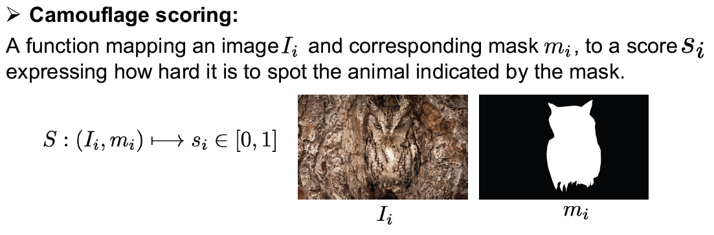

# The Making and Breaking of Camouflage




### Dataset Preparation Steps
* 1- Crop the images around the camouflaged animal so that only its immediate surrounding area is taken into account: 

Examples:

For a still image dataset:
```
python utils/crop.py --data_dir ../datasets/CHAMELEON --out_data_dir ../datasets/CHAMELEON_crop --type still
```

For a video dataset:
```
python utils/crop.py --data_dir ../datasets/MoCA_Video/TrainDataset_per_sq/ --out_data_dir ../datasets/Moca_Video_Train_crop --type video
```


### Citation

If you find this repo useful for your research, please consider citing our paper: 

```
@InProceedings{Lamdouar23,
  author       = "Hala Lamdouar and Weidi Xie and Andrew Zisserman",
  title        = "The Making and Breaking of Camouflage",
  booktitle    = "IEEE International Conference on Computer Vision",
  year         = "2023",
}
```